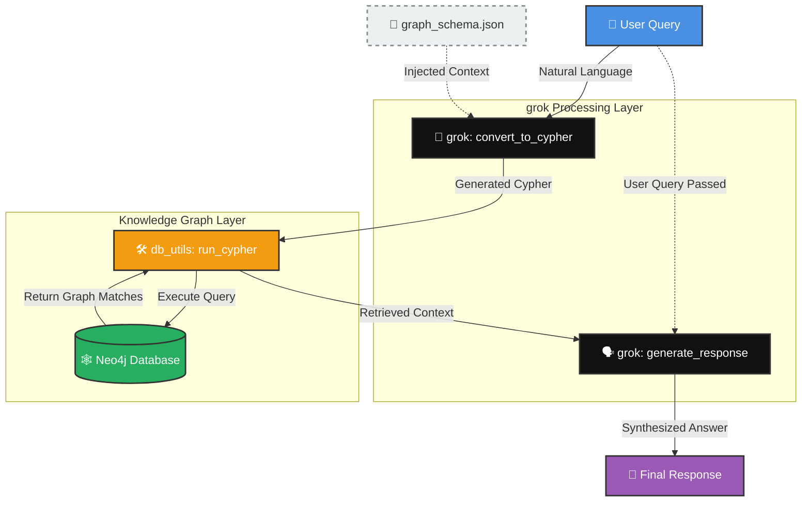

<h1 align="center">📊 Knowledge Graph RAG: Neo4j + grok Integration</h1>

<p align="center">
  <a href="https://github.com/AbdessamadIahlaoui/neo4j-grok-rag/stargazers"></a>
  <a href="https://github.com/AbdessamadIahlaoui/neo4j-grok-rag/network/members"></a>
  <a href="https://github.com/AbdessamadIahlaoui/neo4j-grok-rag/issues"></a>
  <a href="https://opensource.org/licenses/MIT"></a>
  
  
  
</p>

<p align="center">
  <em>A production-grade Retrieval-Augmented Generation (RAG) system utilizing the power of Neo4j Knowledge Graphs and xAI's grok to achieve relationship-aware, hallucination-free AI responses.</em>
</p>

---


## 🌟 Overview

Welcome to the **Knowledge Graph RAG (Retrieval-Augmented Generation)** project! Unlike traditional vector-search RAG that relies solely on semantic text similarity, this architecture grounds LLM responses in **structured, external knowledge** using a Neo4j graph database. 

By leveraging **xAI's grok** via API, the system achieves remarkable accuracy. Relationships between entities (like actors, directors, and movies) become first-class citizens of the data model. Graph traversals handle complex queries—such as *"Who acted in The Matrix?"*—with unparalleled precision, directly addressing the limitations of vector databases.

What started as an experimental Jupyter Notebook has been fully transformed into a **robust, modular Python architecture** designed for correctness, security, and scalability.

---

## 🚀 Features

- **🧠 Schema Injection**: Completely eliminates label hallucinations (e.g., misinterpreting `:Person` as `:Actor`) by injecting a dynamic `graph_schema.json` directly into the grok prompt.
- **⚡ grok Integration**: Utilizes xAI's hyper-intelligent `grok-beta` model for accurate Cypher query generation and natural language response synthesis.
- **🛡️ Pre-flight Query Validation**: Every generated Cypher query is safety-tested using `EXPLAIN` before execution to prevent silent failures and syntax errors.
- **🔒 Secure Credential Management**: Complete integration with `.env` workflows, ensuring Neo4j and xAI API keys are never accidentally committed.
- **🚦 Graceful Fallbacks**: Implements automatic fallback logic if an overly specific query returns zero initial results.

---

## 📐 Architecture Diagram



---

## 🛠️ Installation

Get the project running on your local machine .

### Prerequisites
- Python 3.10+
- A running instance of Neo4j 5.26+ (with the built-in Movies dataset loaded)
- An active xAI API Key

### Steps

1. **Clone the repository:**
   ```bash
   git clone https://github.com/Abdessamadlhaloui/Neo4j_Cypher_GDS_GraphQL_LLM_Knowledge_Graphs_for_RAG
   cd Neo4j_Cypher_GDS_GraphQL_LLM_Knowledge_Graphs_for_RAG
   ```

2. **Set up a virtual environment (Recommended):**
   ```bash
   python -m venv venv
   source venv/bin/activate  
   ```

3. **Install dependencies:**
   ```bash
   pip install -r requirements.txt
   ```

4. **Configure your environment:**
   Copy the example environment file and add your credentials.
   ```bash
   cp .env.example .env
   ```
   *Edit `.env` to include your `XAI_API_KEY`, `NEO4J_URI`, `NEO4J_USER`, and `NEO4J_PASSWORD`.*

---

## 💻 Usage

Run the graph-RAG pipeline directly from your terminal using the built-in CLI module.

```bash
python main.py --query "Who acted in The Matrix?"
```

---


## 👨‍💻 About the Author

**Abdessamad Iahlaoui**  
📍 *Morocco*


🎓 **Certification:** 
- **Course:** Neo4j: Cypher, GDS, GraphQL, LLM, Knowledge Graphs for RAG 
- **Platform:** Coursera
- **Date Completed:** March 7, 2026
- **Verification:** [Verify on Coursera](https://coursera.org/verify/AFG9H02UX8U3) 


🔗 **Connect with me:**  
[](https://www.linkedin.com/in/abdessamad-lahlaoui-315615253/)


